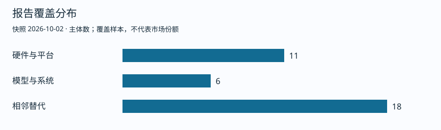
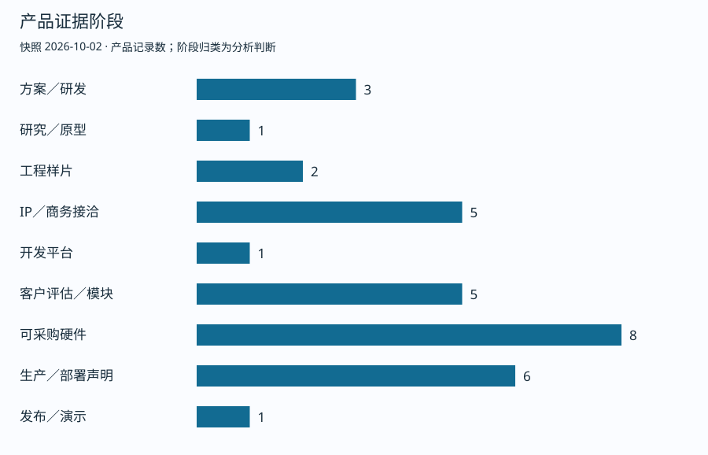
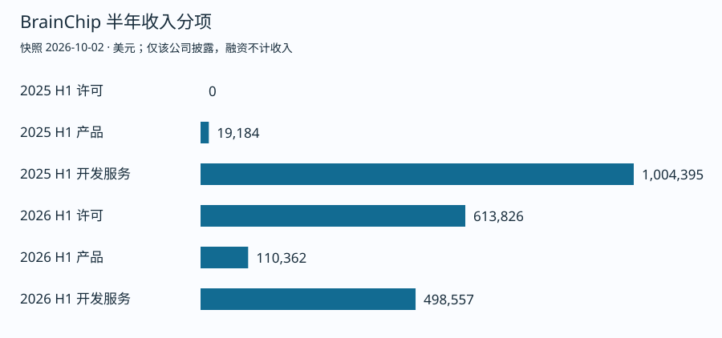

# 类脑芯片市场报告

快照：2026年10月2日。覆盖市场分布、竞争者、商业化证据和行业动态。 当前样本含35个主体、33组产品和20项关键事件。**统计为报告覆盖样本，不代表市场份额。**

[阅读完整报告](REPORT.md) · [下载可追溯 Excel](market-evidence.xlsx) · [原始数据 JSON](evidence.json)

## 本轮判断变化（检索2026-10-02）

|追溯项|补充证据|判断边界|
|---|---|---|
|C005／P033／T018|[Sandia使用方](https://www.sandia.gov/research/news/brain-based-computing-for-nuclear-deterrence-solutions/)确认2025年3月Braunfels到货、已部署并开展热流随机游走模拟；原文发布2025-06-04|由商业可用补充为使用方确认科研部署；合同、支付、供应商收入未知|
|P033／T019|[莱比锡大学](https://www.uni-leipzig.de/newsdetail/artikel/vom-gehirn-inspiriert-supercomputer-staerkt-ki-forschung-an-der-universitaet-leipzig-2025-10-28)于2025-10-28确认10月系统投入运行|约400万欧元是科研基础设施资助，不能计采购额或SpiNNcloud收入|
|T020|[官方标签](https://gitlab.com/spinnaker2/py-spinnaker2/-/tags)记录v0.8.2首次公开Docker镜像；关联提交日2026-09-23，[当前文档](https://spinnaker2.gitlab.io/py-spinnaker2/)与[镜像库](https://hub.docker.com/r/spinnaker2/py-spinnaker2/tags)可交叉核验|提交日期不替代首推日；软件公开不证明规模化片上训练或持续学习量产|
|路线归类|[ScaDS.AI药物项目](https://scads.ai/research/ai-algorithms-and-methods/methods-and-hardware-for-neuro-inspired-computing/projects/drug-discovery-on-the-spinnaker2-neuromorphic-supercomputer/)明确采用int8 DNN|科研系统包含DNN和数值任务，不能一律统计为SNN训练；未核到药企付费客户|

对芯灵的影响（分析）：通用动态状态和物理计算定位，需要与已部署的事件通信混合计算系统做同任务比较。具名客户、软件可获得性与端到端系统收益比架构标签更能说明竞争位置。

## 覆盖分布

## 商业化证据阶段

研究、样片、开发板、客户评估、供货和收入分别记录。厂商宣称、已确认事实、分析与未知项保留在正文和数据中。

## 收入追溯

[BrainChip监管半年报原文](https://investor.brainchip.com/wp-content/uploads/2026/09/2026-08-26-June-2026-half-yearly-report.pdf)。此图不能代表整个类脑市场，也不能用于估算其他企业收入。

## 关键对象索引

|编号|主体|分层|路线|证据来源|
|---|---|---|---|---|
|C001|BrainChip|硬件与平台|全数字事件驱动Akida；芯片、M.2／PCIe模块、第三方开发板及IP|[原始来源](https://investor.brainchip.com/wp-content/uploads/2026/09/2026-08-26-June-2026-half-yearly-report.pdf)|
|C002|Innatera|硬件与平台|Pulsar异构微控制器，含SNN、RISC-V、CNN及FFT|[原始来源](https://www.innatera.com/newsroom/joya-design-takes-neuromorphic-chip-from-design-to-device-with-first-innatera-powered-consumer-audio-product-at-awe-china/)|
|C003|SynSense时识|硬件与平台|Speck感算一体SNN、Aeveon高速视觉路线、iniVation事件相机及Rigi神经信号采集|[原始来源](https://www.synsense.ai/synsense-and-inivation-join-forces-to-form-leading-neuromorphic-technology-provider/)|
|C004|Prophesee|硬件与平台|事件视觉传感、软件、伙伴相机生态及Mantara整机|[原始来源](https://www.prophesee.ai/event-based-camera-partners/)|
|C005|SpiNNcloud|硬件与平台|SpiNNaker2事件通信、Arm可编程核与混合DNN／SNN科研系统|[原始来源](https://www.sandia.gov/research/news/brain-based-computing-for-nuclear-deterrence-solutions/)|
|C006|灵汐Lynxi|硬件与平台|KA200系列，ANN与SNN融合|[原始来源](https://bidl-zh.readthedocs.io/en/latest/overview.html)|
|C007|达尔文体系|硬件与平台|Darwin系列、物源软件平台|[原始来源](https://www.darwinware.com/en/news/2025/publish)|
|C008|Intel|硬件与平台|Loihi2、Lava、Hala Point|[原始来源](https://www.intc.com/news-events/press-releases/detail/1691/intel-builds-worlds-largest-neuromorphic-system-to)|
|C009|他山科技|硬件与平台|触觉感知芯片、传感器、TS-ECHO数采与仿真；E10A动态触觉路线|[原始来源](https://www.orbbec.com/news/orbbec-and-tashan-technology-form-strategic-partnership-to-advance-vision-tactile-data-collection-solutions/)|
|C010|脑智算芯|硬件与平台|超大规模类脑智算，芯模算一体|[原始来源](https://www.thepaper.cn/newsDetail_forward_33199538)|
|C011|维泛智能|硬件与平台|BiGPU，GPU与BPU双模同构；具身大小脑芯片、BrainOS、OmniRT|[原始来源](https://news.bjd.com.cn/2026/08/24/90070084.shtml)|
|C012|具脑磐石 EBKernel|模型与系统|Cog-WM 1.0认知世界模型；按台／按年许可、软硬一体模组、行业方案与RaaS四种交付形态|[原始来源](https://www.ebkernel.com/)|
|C013|最终序列|模型与系统|飞行具身世界模型、端侧SNN基座、芯片模组与嵌入式BOX|[原始来源](https://www.nanjing.gov.cn/njxx/202608/t20260827_5900119.html)|
|C014|寰宇心生 WorldMind|模型与系统|神经认知世界模型、多模态数据体系与训练基础设施|[原始来源](https://www.chinastarmarket.cn/detail/2476378)|
|C015|羲悉智能|模型与系统|类脑预测模型；System 1执行与System 2层级记忆；自进化智能体基座|[原始来源](https://xisiid.com/blog-static/articles/%E4%BB%8E%E8%AF%AD%E8%A8%80%E7%94%9F%E6%88%90%E5%88%B0%E7%8A%B6%E6%80%81%E9%A2%84%E6%B5%8B%20-%20%E7%BE%B2%E6%82%89%E7%89%88%E5%BC%8F.html)|
|C016|中科类脑|模型与系统|异构计算系统、面向电力的多模态大模型、算电碳协同系统|[原始来源](https://www.leinao.ai/about)|
|C017|POLYN|相邻替代|NASP固定模拟网络前端；VAD与VibroSense TMS工程芯片|[原始来源](https://polyn.ai/polyn-delivers-first-vibrosense-tms-engineering-sensor-nodes-for-customer-evaluation/)|
|C018|Blumind|相邻替代|BM110音频／时序、BM210视觉；AMPL全模拟IP、chiplet与KGD|[原始来源](https://blumind.ai/products/)|
|C019|Aspinity|相邻替代|AnalogML：AML100模拟AI前端；AML200射频模拟AI|[原始来源](https://www.aspinity.com/products.html)|
|C020|九天睿芯REEXEN|相邻替代|既有SRAM存算边缘芯片；HBF SSD、ADA300／400与服务器路线|[原始来源](https://www.reexen.com/)|
|C021|Rain AI|相邻替代|数字存内计算tile与软件IP；后续自有芯片|[原始来源](https://rain.ai/products)|
|C022|MemryX|相邻替代|MX3近存数据流NPU与Cascade模块；MX3+／MX4后续路线|[原始来源](https://memryx.ai/news/express-luck-selects-memryx-for-ai-enabled-smart-manufacturing-operations/)|
|C023|Synthara|相邻替代|ComputeRAM数字存内计算SRAM IP宏|[原始来源](https://synthara.ai/wp-content/uploads/2025/03/EW-version-Leaflet-Trifolds.pdf)|
|C024|Neurxcore|相邻替代|神经处理器IP及软件|[原始来源](https://www.neurxcore.com/)|
|C025|爱芯元智Axera|相邻替代|AX8850系列传统NPU SoC、算力卡与本地视频智能体|[原始来源](https://www.axera-tech.com/zh-hans/news/3270.html)|
|C026|Syntiant|相邻替代|NDP115/120/200/250深度神经网络处理器；Knowles消费MEMS麦克风业务；模型与软件|[原始来源](https://www.syntiant.com/press-release/syntiant-completes-acquisition-of-knowles-consumer-mems-microphone-division/)|
|C027|Mythic|相邻替代|M1模拟CIM APU；未来Vanguard混合路线；Videantis数字处理IP|[原始来源](https://global.honda/en/topics/2026/c_2026-02-04eng.html)|
|C028|AnalogAI|相邻替代|基于SST memBrain SAGE的模拟CIM边缘处理器|[原始来源](https://ir.microchip.com/news-events/press-releases/detail/1414/analogai-selects-membrain-sage-intellectual-property-from-silicon-storage-technology-for-its-first-real-world-edge-ai-processors)|
|C029|semiQa|相邻替代|ANN1000边缘与ANN2000数据中心模拟神经网络IP|[原始来源](https://semiqa.com/en/technology)|
|C030|STMicroelectronics|相邻替代|STM32N6 Cortex-M55 MCU＋Neural-ART NPU；STM32Cube AI Studio与N6开发板|[原始来源](https://www.st.com/en/evaluation-tools/stm32n6570-dk.html)|
|C031|NXP|相邻替代|i.MX RT700双Cortex-M33＋HiFi DSP＋eIQ Neutron NPU；MCUXpresso|[原始来源](https://www.nxp.com/design/design-center/software/development-software/mcuxpresso-software-and-tools-/i-mx-rt700-evaluation-kit:MIMXRT700-EVK)|
|C032|Synaptics|相邻替代|Astra SL2610多模态IoT处理器；Torq T1／Coral NPU；Astra Machina开发套件|[原始来源](https://www.synaptics.com/products/embedded-processors/sl2610-product-line)|
|C033|Hailo|相邻替代|Hailo-10H离散数据流AI加速器与M.2模块；视觉、LLM与VLM本地推理|[原始来源](https://hailo.ai/company-overview/newsroom/news/hailo-announces-general-availability-of-hailo-10h-edge-ai-accelerator-with-generative-ai-capabilities/)|
|C034|Ambiq|相邻替代|Apollo510／Apollo510 Lite Cortex-M55超低功耗SoC；neuralSPOT、HELIA与Zephyr|[原始来源](https://www.digikey.com/en/products/detail/ambiq-micro-inc/AP510BEVB/28007828)|
|C035|World Labs|模型与系统|Atlas／Marble空间智能世界模型；World API；SceniX real-to-sim-to-real机器人仿真|[原始来源](https://ir.amd.com/news-events/press-releases/detail/1299/amd-to-acquire-world-labs-to-advance-the-future-of-ai-compute)|

## 交互网页

[交互地图源码](dashboard.html)和[完整网页源码](index.html)可下载后在浏览器打开。GitHub 仓库直接显示 Markdown 和静态图表；当前未启用在线网页托管。

## 更新与追溯

当前为从主报告读取并导出的快照。正文保留逐项事件日期、发布日期、检索日期与来源；Excel 和 JSON 使用主体、产品、事件编号关联。后续修改可通过 GitHub 提交历史追溯，不能将快照视为实时数据。
